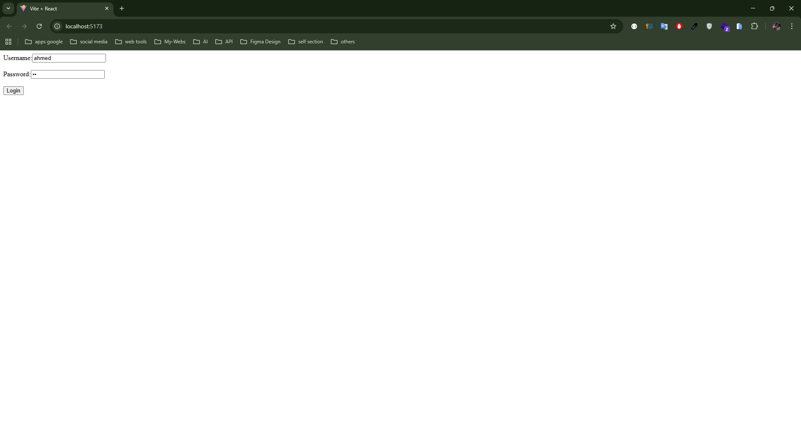
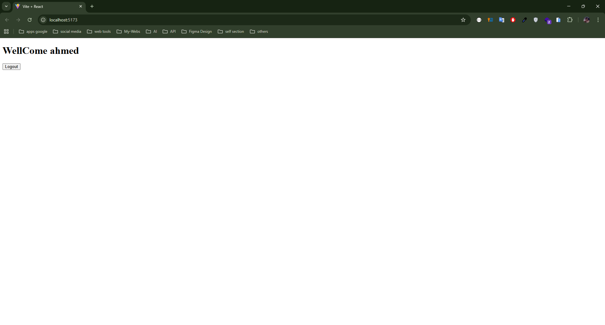

1. **Create** a `LoginForm` component that:
    - Displays input fields for username and password.
    - Shows a "Login" button.
2. **Implement State Management:**
    - Use `useState` to manage form inputs and authentication status.
3. **Implement Conditional Rendering:**
    - Before login, display the login form.
    - After a successful login (simulate login on form submission), display a welcome message with the username.
    - Include a "Logout" button to reset the authentication state.

    
    