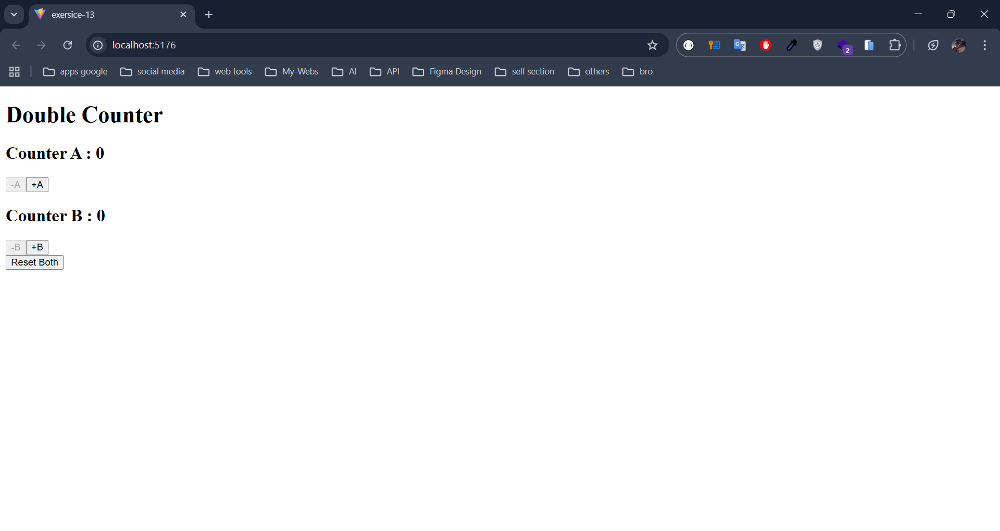

## **Simpler Challenge: Double Counter**

### **Scenario**

We have **two counters** in a single component (`CounterA` and `CounterB`). We want to manage them **with one reducer**—allowing increment, decrement, and reset actions for each counter.

### **Objectives**

1. **Create** a `DoubleCounter` component using the `useReducer` Hook.
2. **Implement** actions to:
    - **Increment** Counter A (`INCREMENT_A`)
    - **Decrement** Counter A (`DECREMENT_A`)
    - **Increment** Counter B (`INCREMENT_B`)
    - **Decrement** Counter B (`DECREMENT_B`)
    - **Reset** both counters to 0 (`RESET_ALL`)

### **Implementation Outline**

1. **Define the Initial State and the Reducer**
    - The initial state has two counters:
        
        ```
        const initialState = {
          counterA: 0,
          counterB: 0,
        };
        
        ```
        
    - The reducer handles each action type.
2. **Build the `DoubleCounter` Component**
    - Use `useReducer(reducer, initialState)`.
    - Render two separate sections—one for each counter.
    - Provide buttons for incrementing/decrementing each counter.
    - Provide a reset button to reset **both** counters at once.
    