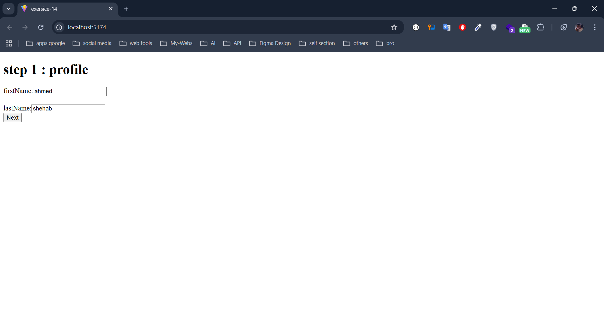
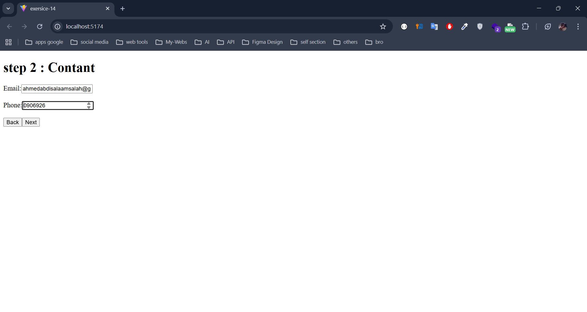
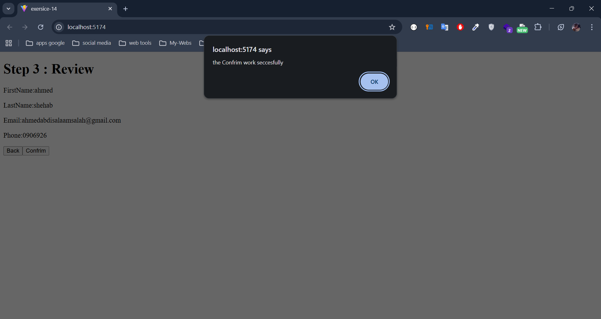

### **Task Overview**

1. **Create** a `MultiStepForm` component that:
    - Has **three steps**:
        1. **Profile** (collecting `firstName`, `lastName`)
        2. **Contact** (collecting `email`, `phone`)
        3. **Review** (display entered data, option to confirm or go back and edit)
    - Maintains form data and current step using `useReducer`.
2. **Implement Actions** to:
    - **Update** a specific field (`UPDATE_FIELD`).
    - **Go to the next step** (`NEXT_STEP`).
    - **Go to the previous step** (`PREV_STEP`).
    - **Reset** the entire form (`RESET_FORM`) if the user cancels or after successful submission.
3. **Design the Reducer** to handle all these actions cleanly.

