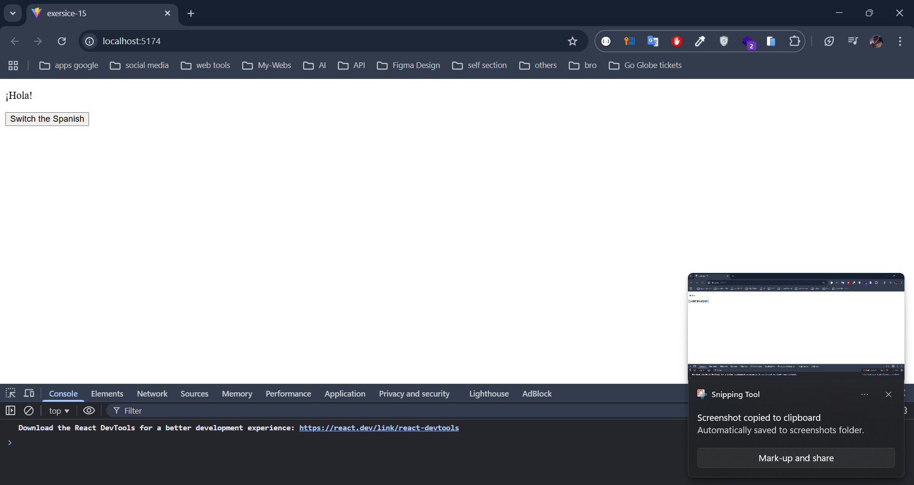
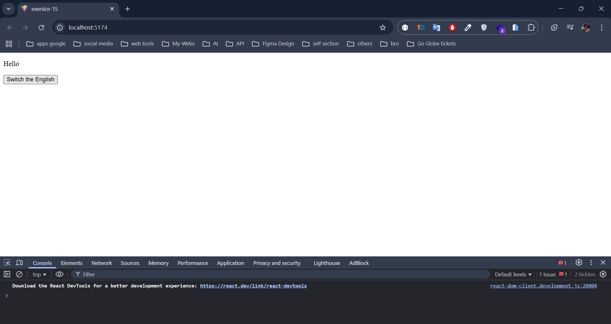

## **6. Practical Challenges**

Below are **two** challenges to reinforce your understanding of `useContext`. The first is a **Language Selector** (similar to the example you saw), and the second is a **Shopping Cart** scenario.

