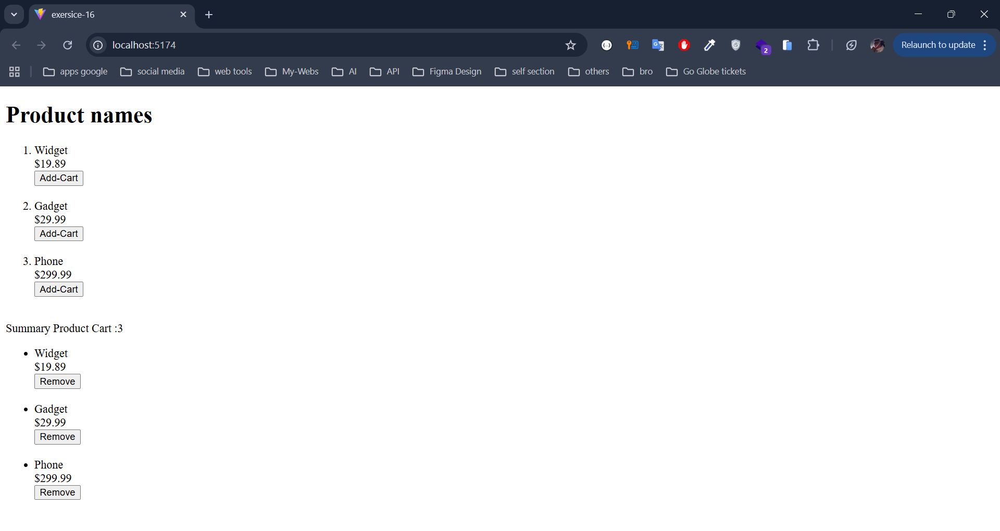

### **Challenge B: Shopping Cart Context**

**Scenario**

You have a small e-commerce site where multiple components need access to **cart** data—like the number of items in the cart and the total price.

**Task**

1. **Create** a `CartContext` with an initial empty cart array or object.
2. **Provide** the cart context in your `App`.
3. **Add** or **remove** items from the cart in various components (e.g., a `ProductItem` component).
4. **Display** the cart details in a `CartSummary` component, **without** prop drilling.

**Hints**

- You might store `cartItems` in a state hook in `App`.
- A function like `addToCart(item)` or `removeFromCart(itemId)` can be stored in the context, so you can call it from anywhere.
- `CartSummary` can show the total count or total price by reading `cartItems` from context.

