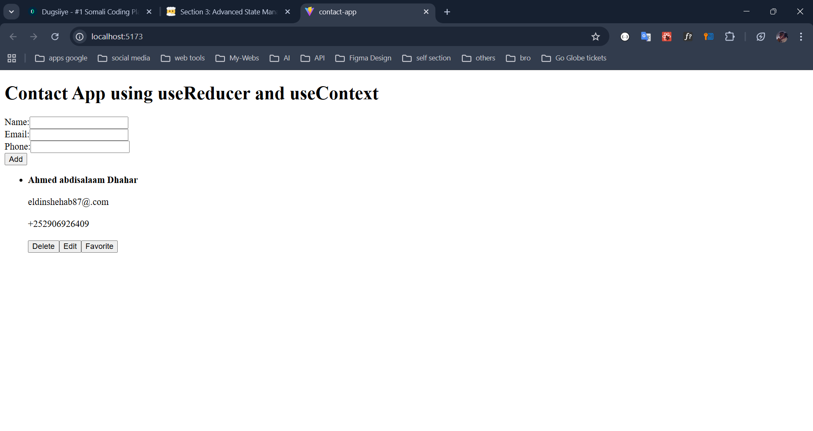

# **Section 3: Advanced State Management and Rendering Techniques**

---

### **Overview**

**Section Objectives:**

- Learn how to render lists and understand the importance of keys in React.
- Master conditional rendering techniques to create dynamic user interfaces.
- Understand event handling in React and how it differs from traditional JavaScript.
- Manage complex state using the `useReducer` Hook.
- Utilize the Context API and `useContext` Hook for global state management.
- Create custom Hooks to encapsulate reusable logic.
- Apply these concepts in practical applications.

**Lessons in this Section:**

1. **Lesson 3.1:** Rendering Lists and Understanding Keys
2. **Lesson 3.2:** Conditional Rendering Techniques
3. **Lesson 3.3:** Event Handling in React
4. **Lesson 3.4:** Managing Complex State with `useReducer`
5. **Lesson 3.5:** Using the `useContext` Hook for Global State Management
6. **Lesson 3.6:** Creating Custom Hooks
7. **Lesson 3.7:** Practical Application: Building a Todo App with `useReducer`

---

### **Lesson 3.1: Rendering Lists and Understanding Keys**

**Lesson Objectives:**

- Learn how to render lists in React using the `map()` function.
- Understand the importance of keys in list rendering.
- Practice rendering lists and using keys correctly.

**Lesson Content:**

### **1. Rendering Lists in React**

- **Using the `map()` Function:**
    - Iterates over an array and returns a list of elements.
    - **Example:**
        
        ```jsx
        const fruits = ['Apple', 'Banana', 'Cherry'];
        
        const FruitList = () => {
          return (
            <ul>
              {fruits.map((fruit) => (
                <li key={fruit}>{fruit}</li>
              ))}
            </ul>
          );
        };
        
        ```
        
- **Importance of the `key` Prop:**
    - Helps React identify which items have changed, are added, or are removed.
    - Keys should be stable, unique, and constant across renders.
    - Common mistakes include using array indices as keys when items can change order.

### **2. Best Practices for Keys**

- **Use Unique Identifiers:**
    - If items have unique IDs, use them as keys.
- **Avoid Using Indices as Keys:**
    - Using indices can lead to issues when items are reordered or filtered.
- **Example with Unique IDs:**
    
    ```jsx
    const todos = [
      { id: 1, text: 'Learn React' },
      { id: 2, text: 'Build a Project' },
    ];
    
    const TodoList = () => {
      return (
        <ul>
          {todos.map((todo) => (
            <li key={todo.id}>{todo.text}</li>
          ))}
        </ul>
      );
    };
    
    ```
    

### **3. Handling Empty or Undefined Lists**

- **Conditional Rendering of Lists:**
    
    ```jsx
    const items = [];
    
    const ItemList = () => {
      return (
        <div>
          {items.length > 0 ? (
            <ul>
              {items.map((item) => (
                <li key={item.id}>{item.name}</li>
              ))}
            </ul>
          ) : (
            <p>No items found.</p>
          )}
        </div>
      );
    };
    
    ```
    

### **Practical Challenge for Lesson 3.1**

**Challenge Title:** *Display a List of Users*

**Task:**

1. **Create** a `UserList` component that:
    - Receives an array of user objects, each with `id`, `name`, and `email`.
2. **Render** the list of users in a table or list format.
3. **Ensure** that each user is displayed correctly and that the `key` prop is used appropriately.

**Sample Code:**

```jsx
// UserList.jsx
const UserList = ({ users }) => {
  return (
    <div>
      <h2>User List</h2>
      {users.length > 0 ? (
        <ul>
          {users.map((user) => (
            <li key={user.id}>
              {user.name} ({user.email})
            </li>
          ))}
        </ul>
      ) : (
        <p>No users found.</p>
      )}
    </div>
  );
};

export default UserList;

// App.jsx
import UserList from './UserList';

const App = () => {
  const users = [
    { id: 1, name: 'Alice', email: 'alice@example.com' },
    { id: 2, name: 'Bob', email: 'bob@example.com' },
  ];

  return (
    <div>
      <UserList users={users} />
    </div>
  );
};

export default App;

```

---

### **Lesson 3.2: Conditional Rendering Techniques**

**Lesson Objectives:**

- Understand how to render components conditionally in React.
- Learn different techniques for conditional rendering.
- Practice implementing conditional rendering based on component state or props.

**Lesson Content:**

### **1. Conditional Rendering in React**

- **Declarative Rendering:**
    - Control what is rendered based on state or props.
    - React updates the UI when state or props change.

### **2. Techniques for Conditional Rendering**

**A. Using `if` Statements**

- **Outside JSX:**
    
    ```jsx
    const Greeting = ({ isLoggedIn }) => {
      if (isLoggedIn) {
        return <h1>Welcome back!</h1>;
      } else {
        return <h1>Please sign in.</h1>;
      }
    };
    
    ```
    

**B. Using Ternary Operators**

- **Inline Conditional Rendering:**
    
    ```jsx
    const Greeting = ({ isLoggedIn }) => {
      return <h1>{isLoggedIn ? 'Welcome back!' : 'Please sign in.'}</h1>;
    };
    
    ```
    

**C. Using Logical `&&` Operator**

- **Conditional Rendering of Components:**
    
    ```jsx
    const Notification = ({ unreadMessages }) => {
      return (
        <div>
          <h1>Hello!</h1>
          {unreadMessages.length > 0 && (
            <p>You have {unreadMessages.length} unread messages.</p>
          )}
        </div>
      );
    };
    
    ```
    

### **3. Practical Examples**

**Example: Toggle Visibility**

```jsx
import { useState } from 'react';

const ToggleMessage = () => {
  const [isVisible, setIsVisible] = useState(false);

  const toggle = () => setIsVisible(!isVisible);

  return (
    <div>
      <button onClick={toggle}>
        {isVisible ? 'Hide Message' : 'Show Message'}
      </button>
      {isVisible && <p>This is a toggleable message.</p>}
    </div>
  );
};

export default ToggleMessage;

```

### **Practical Challenge for Lesson 3.2**

**Challenge Title:** *Create a Login Form with Conditional Rendering*

**Task:**

1. **Create** a `LoginForm` component that:
    - Displays input fields for username and password.
    - Shows a "Login" button.
2. **Implement State Management:**
    - Use `useState` to manage form inputs and authentication status.
3. **Implement Conditional Rendering:**
    - Before login, display the login form.
    - After a successful login (simulate login on form submission), display a welcome message with the username.
    - Include a "Logout" button to reset the authentication state.

**Sample Code:**

```jsx
// LoginForm.jsx
import { useState } from 'react';

const LoginForm = () => {
  const [username, setUsername] = useState('');
  const [password, setPassword] = useState('');
  const [isLoggedIn, setIsLoggedIn] = useState(false);

  const handleLogin = (event) => {
    event.preventDefault();
    // Simulate authentication
    if (username && password) {
      setIsLoggedIn(true);
    }
  };

  const handleLogout = () => {
    setUsername('');
    setPassword('');
    setIsLoggedIn(false);
  };

  if (isLoggedIn) {
    return (
      <div>
        <h1>Welcome, {username}!</h1>
        <button onClick={handleLogout}>Logout</button>
      </div>
    );
  }

  return (
    <form onSubmit={handleLogin}>
      <h2>Login</h2>
      <div>
        <label>
          Username:
          <input
            type="text"
            value={username}
            onChange={(e) => setUsername(e.target.value)}
            required
          />
        </label>
      </div>
      <div>
        <label>
          Password:
          <input
            type="password"
            value={password}
            onChange={(e) => setPassword(e.target.value)}
            required
          />
        </label>
      </div>
      <button type="submit">Login</button>
    </form>
  );
};

export default LoginForm;

// App.jsx
import LoginForm from './LoginForm';

const App = () => {
  return (
    <div>
      <LoginForm />
    </div>
  );
};

export default App;

```

---

### **Lesson 3.3: Event Handling in React**

**Lesson Objectives:**

- Understand how event handling in React differs from traditional JavaScript.
- Learn how to bind event handlers to components and manage events efficiently.
- Practice handling common events in React components.

**Lesson Content:**

### **1. React's Approach to Event Handling**

- **JSX Event Handling:**
    - Events are handled using JSX attributes that correspond to DOM events.
    - Event handler names are camelCased (e.g., `onClick`, `onChange`).
- **Example:**
    
    ```jsx
    const Button = () => {
      const handleClick = () => {
        alert('Button clicked!');
      };
    
      return <button onClick={handleClick}>Click me</button>;
    };
    
    ```
    

### **2. Binding Event Handlers**

- **Passing Arguments to Event Handlers:**
    
    ```jsx
    const Item = ({ id }) => {
      const handleDelete = (itemId) => {
        // Delete item logic
      };
    
      return <button onClick={() => handleDelete(id)}>Delete</button>;
    };
    
    ```
    

### **3. Common Events in React**

- **Mouse Events:** `onClick`, `onDoubleClick`, `onMouseEnter`, `onMouseLeave`
- **Form Events:** `onChange`, `onSubmit`, `onFocus`, `onBlur`
- **Keyboard Events:** `onKeyDown`, `onKeyUp`, `onKeyPress`

### **4. Practical Challenge for Lesson 3.3**

**Challenge Title:** *Interactive Counter*

**Task:**

1. **Create** a `Counter` component that:
    - Displays a number representing the count.
    - Includes "Increment" and "Decrement" buttons.
2. **Implement Event Handling:**
    - When the "Increment" button is clicked, increase the count by 1.
    - When the "Decrement" button is clicked, decrease the count by 1 (do not allow negative numbers).
3. **Use State Management:**
    - Use `useState` to manage the count.

**Sample Code:**

```jsx
// Counter.jsx
import { useState } from 'react';

const Counter = () => {
  const [count, setCount] = useState(0);

  const increment = () => setCount(count + 1);

  const decrement = () => {
    if (count > 0) setCount(count - 1);
  };

  return (
    <div>
      <h2>Count: {count}</h2>
      <button onClick={decrement} disabled={count === 0}>
        Decrement
      </button>
      <button onClick={increment}>Increment</button>
    </div>
  );
};

export default Counter;

// App.jsx
import Counter from './Counter';

const App = () => {
  return (
    <div>
      <Counter />
    </div>
  );
};

export default App;

```

---

### **Lesson 3.4: Managing Complex State with `useReducer`**

**Lesson Objectives:**

- Understand when to use `useReducer` over `useState`.
- Learn how to manage complex state logic using the `useReducer` Hook.
- Explore the concepts of reducers, actions, and dispatching actions.
- Practice implementing `useReducer` in practical examples.

**Lesson Content:**

### **1. When to Use `useReducer`**

- **Limitations of `useState`:**
    - Managing complex state can become unwieldy with multiple `useState` calls.
    - Difficult to update multiple related state variables simultaneously.
- **Benefits of `useReducer`:**
    - Ideal for complex state logic involving multiple sub-values.
    - Centralizes state updates in a reducer function.
    - Makes state transitions more predictable.

### **2. Understanding Reducers**

- **Reducer Function:**
    - A pure function that takes the current state and an action, and returns the new state.
    - Signature: `(state, action) => newState`
- **Actions:**
    - Objects that describe what happened.
    - Typically have a `type` property and may include additional data.
- **Example Reducer:**
    
    ```jsx
    const reducer = (state, action) => {
      switch (action.type) {
        case 'increment':
          return { count: state.count + 1 };
        case 'decrement':
          return { count: state.count - 1 };
        default:
          return state;
      }
    };
    
    ```
    

### **3. Using the `useReducer` Hook**

- **Syntax:**
    
    ```jsx
    const [state, dispatch] = useReducer(reducer, initialState);
    
    ```
    
- **Parameters:**
    - `reducer`: The reducer function.
    - `initialState`: The initial state value.
- **Dispatching Actions:**
    - Use `dispatch({ type: 'actionType', payload: data })` to trigger state updates.

### **4. Practical Example: Counter with `useReducer`**

**Implementation:**

```jsx
import { useReducer } from 'react';

const initialState = { count: 0 };

const reducer = (state, action) => {
  switch (action.type) {
    case 'increment':
      return { count: state.count + 1 };
    case 'decrement':
      return state.count > 0 ? { count: state.count - 1 } : state;
    case 'reset':
      return initialState;
    default:
      return state;
  }
};

const CounterWithReducer = () => {
  const [state, dispatch] = useReducer(reducer, initialState);

  return (
    <div>
      <h2>Count: {state.count}</h2>
      <button
        onClick={() => dispatch({ type: 'decrement' })}
        disabled={state.count === 0}
      >
        Decrement
      </button>
      <button onClick={() => dispatch({ type: 'increment' })}>Increment</button>
      <button onClick={() => dispatch({ type: 'reset' })}>Reset</button>
    </div>
  );
};

export default CounterWithReducer;

```

### **5. When to Choose `useReducer` over `useState`**

- **Complex State Logic:**
    - When state logic is complex and involves multiple sub-values.
- **State Depends on Previous State:**
    - When the next state depends on the previous one.
- **Debugging and Testing:**
    - Reducer functions can be easier to test and debug.

---

## **Simpler Challenge: Double Counter**

### **Scenario**

We have **two counters** in a single component (`CounterA` and `CounterB`). We want to manage them **with one reducer**—allowing increment, decrement, and reset actions for each counter.

### **Objectives**

1. **Create** a `DoubleCounter` component using the `useReducer` Hook.
2. **Implement** actions to:
    - **Increment** Counter A (`INCREMENT_A`)
    - **Decrement** Counter A (`DECREMENT_A`)
    - **Increment** Counter B (`INCREMENT_B`)
    - **Decrement** Counter B (`DECREMENT_B`)
    - **Reset** both counters to 0 (`RESET_ALL`)

### **Implementation Outline**

1. **Define the Initial State and the Reducer**
    - The initial state has two counters:
        
        ```
        const initialState = {
          counterA: 0,
          counterB: 0,
        };
        
        ```
        
    - The reducer handles each action type.
2. **Build the `DoubleCounter` Component**
    - Use `useReducer(reducer, initialState)`.
    - Render two separate sections—one for each counter.
    - Provide buttons for incrementing/decrementing each counter.
    - Provide a reset button to reset **both** counters at once.

### **Example Implementation**

```jsx
// doubleCounterReducer.js
export const initialState = {
  counterA: 0,
  counterB: 0,
};

export function doubleCounterReducer(state, action) {
  switch (action.type) {
    case 'INCREMENT_A':
      return { ...state, counterA: state.counterA + 1 };
    case 'DECREMENT_A':
      return {
        ...state,
        counterA: state.counterA > 0 ? state.counterA - 1 : 0,
      };
    case 'INCREMENT_B':
      return { ...state, counterB: state.counterB + 1 };
    case 'DECREMENT_B':
      return {
        ...state,
        counterB: state.counterB > 0 ? state.counterB - 1 : 0,
      };
    case 'RESET_ALL':
      return initialState;
    default:
      return state;
  }
}

```

```jsx
// DoubleCounter.jsx
import React, { useReducer } from 'react';
import { doubleCounterReducer, initialState } from './doubleCounterReducer';

const DoubleCounter = () => {
  const [state, dispatch] = useReducer(doubleCounterReducer, initialState);

  return (
    <div>
      <h2>Double Counter</h2>

      {/* Counter A */}
      <div>
        <h3>Counter A: {state.counterA}</h3>
        <button onClick={() => dispatch({ type: 'DECREMENT_A' })} disabled={state.counterA === 0}>
          - A
        </button>
        <button onClick={() => dispatch({ type: 'INCREMENT_A' })}>+ A</button>
      </div>

      {/* Counter B */}
      <div>
        <h3>Counter B: {state.counterB}</h3>
        <button onClick={() => dispatch({ type: 'DECREMENT_B' })} disabled={state.counterB === 0}>
          - B
        </button>
        <button onClick={() => dispatch({ type: 'INCREMENT_B' })}>+ B</button>
      </div>

      {/* Reset both counters */}
      <div>
        <button onClick={() => dispatch({ type: 'RESET_ALL' })}>Reset Both</button>
      </div>
    </div>
  );
};

export default DoubleCounter;

```

### **Key Takeaways**

1. **Shared State**: Both counters live in the **same** state object, making it easy to reset them together.
2. **Individual Actions**: Each counter has its own `INCREMENT_` and `DECREMENT_` actions, keeping the logic straightforward.
3. **`useReducer` vs. `useState`**: If you tried managing these counters with **two separate** `useState` hooks, it would still be **simple** here, but `useReducer` keeps the logic in **one place**—helpful if you add more counters or more complex actions.

---

### **Practical Example for Lesson 3.4**

**Challenge Title:** *Build a Todo App with `useReducer`*

**Task:**

1. **Create** a `TodoApp` component that:
    - Manages a list of todos using `useReducer`.
    - Each todo item has `id`, `text`, and `completed` properties.
2. **Implement Actions:**
    - Add a new todo.
    - Toggle a todo's completed status.
    - Delete a todo.
3. **Design the Reducer:**
    - Define actions for 'add', 'toggle', and 'delete'.

**Implementation Steps:**

1. **Define the Initial State and Reducer:**
    
    ```jsx
    const initialState = [];
    
    const reducer = (state, action) => {
      switch (action.type) {
        case 'add':
          return [...state, action.payload];
        case 'toggle':
          return state.map((todo) =>
            todo.id === action.payload
              ? { ...todo, completed: !todo.completed }
              : todo
          );
        case 'delete':
          return state.filter((todo) => todo.id !== action.payload);
        default:
          return state;
      }
    };
    
    ```
    
2. **Implement the `TodoApp` Component:**
    
    ```jsx
    import { useReducer, useState } from 'react';
    
    const TodoApp = () => {
      const [state, dispatch] = useReducer(reducer, initialState);
      const [text, setText] = useState('');
    
      const handleAdd = () => {
        if (text.trim()) {
          const newTodo = {
            id: Date.now(),
            text,
            completed: false,
          };
          dispatch({ type: 'add', payload: newTodo });
          setText('');
        }
      };
    
      return (
        <div>
          <h2>Todo App</h2>
          <input
            type="text"
            value={text}
            onChange={(e) => setText(e.target.value)}
            placeholder="Enter a new todo"
          />
          <button onClick={handleAdd}>Add</button>
          <ul>
            {state.map((todo) => (
              <li key={todo.id}>
                <span
                  style={{
                    textDecoration: todo.completed ? 'line-through' : 'none',
                  }}
                  onClick={() => dispatch({ type: 'toggle', payload: todo.id })}
                >
                  {todo.text}
                </span>
                <button onClick={() => dispatch({ type: 'delete', payload: todo.id })}>
                  Delete
                </button>
              </li>
            ))}
          </ul>
        </div>
      );
    };
    
    export default TodoApp;
    
    ```
    

---

## **Additional Challenge: Multi-Step Form with `useReducer`**

### **Scenario**

You want to build a **multi-step registration form** (e.g., collecting user profile details, contact info, and confirmation). Managing the form state can get tricky with multiple fields across different steps. Using `useReducer` can help centralize and streamline this logic.

### **Task Overview**

1. **Create** a `MultiStepForm` component that:
    - Has **three steps**:
        1. **Profile** (collecting `firstName`, `lastName`)
        2. **Contact** (collecting `email`, `phone`)
        3. **Review** (display entered data, option to confirm or go back and edit)
    - Maintains form data and current step using `useReducer`.
2. **Implement Actions** to:
    - **Update** a specific field (`UPDATE_FIELD`).
    - **Go to the next step** (`NEXT_STEP`).
    - **Go to the previous step** (`PREV_STEP`).
    - **Reset** the entire form (`RESET_FORM`) if the user cancels or after successful submission.
3. **Design the Reducer** to handle all these actions cleanly.

---

### **Suggested Steps to Implement**

### **1. Define Initial State and the Reducer**

```jsx
// formReducer.js

export const initialState = {
  step: 1, // Start at step 1
  firstName: '',
  lastName: '',
  email: '',
  phone: '',
};

export function formReducer(state, action) {
  switch (action.type) {
    case 'UPDATE_FIELD':
      return {
        ...state,
        [action.field]: action.value, // dynamically update the field
      };
    case 'NEXT_STEP':
      return {
        ...state,
        step: state.step + 1,
      };
    case 'PREV_STEP':
      return {
        ...state,
        step: state.step - 1,
      };
    case 'RESET_FORM':
      return initialState;
    default:
      return state;
  }
}

```

### **2. Build the `MultiStepForm` Component**

```jsx
// MultiStepForm.jsx
import React, { useReducer } from 'react';
import { formReducer, initialState } from './formReducer';

const MultiStepForm = () => {
  const [state, dispatch] = useReducer(formReducer, initialState);

  const handleChange = (e) => {
    dispatch({
      type: 'UPDATE_FIELD',
      field: e.target.name,
      value: e.target.value,
    });
  };

  const nextStep = () => dispatch({ type: 'NEXT_STEP' });
  const prevStep = () => dispatch({ type: 'PREV_STEP' });
  const resetForm = () => dispatch({ type: 'RESET_FORM' });

  const handleSubmit = () => {
    // Potentially submit data to an API
    alert('Form submitted successfully!');
    resetForm();
  };

  return (
    <div>
      <h2>Multi-Step Registration</h2>
      {state.step === 1 && (
        <div>
          <h3>Step 1: Profile</h3>
          <label>
            First Name:
            <input
              type="text"
              name="firstName"
              value={state.firstName}
              onChange={handleChange}
            />
          </label>
          <br />
          <label>
            Last Name:
            <input
              type="text"
              name="lastName"
              value={state.lastName}
              onChange={handleChange}
            />
          </label>
          <br />
          <button onClick={nextStep}>Next</button>
        </div>
      )}
      {state.step === 2 && (
        <div>
          <h3>Step 2: Contact</h3>
          <label>
            Email:
            <input
              type="email"
              name="email"
              value={state.email}
              onChange={handleChange}
            />
          </label>
          <br />
          <label>
            Phone:
            <input
              type="tel"
              name="phone"
              value={state.phone}
              onChange={handleChange}
            />
          </label>
          <br />
          <button onClick={prevStep}>Back</button>
          <button onClick={nextStep}>Next</button>
        </div>
      )}
      {state.step === 3 && (
        <div>
          <h3>Step 3: Review</h3>
          <p>
            <strong>First Name:</strong> {state.firstName}
          </p>
          <p>
            <strong>Last Name:</strong> {state.lastName}
          </p>
          <p>
            <strong>Email:</strong> {state.email}
          </p>
          <p>
            <strong>Phone:</strong> {state.phone}
          </p>
          <button onClick={prevStep}>Back</button>
          <button onClick={handleSubmit}>Confirm</button>
        </div>
      )}
      {state.step > 3 && (
        <div>
          <h3>Form Completed</h3>
          <button onClick={resetForm}>Start Over</button>
        </div>
      )}
    </div>
  );
};

export default MultiStepForm;

```

### **3. Usage in Your App**

```jsx
// App.jsx
import React from 'react';
import MultiStepForm from './MultiStepForm';

function App() {
  return (
    <div>
      <MultiStepForm />
    </div>
  );
}

export default App;

```

---

## **Challenge Requirements**

1. **Validation** *(Optional but Recommended)*
    - Add simple validation (e.g., check that `firstName`, `lastName`, and `email` are not empty before allowing Next).
2. **Additional Fields** *(Optional)*
    - Expand the form to include more fields (address, city, state, etc.) for a more realistic example.
3. **Better UX**
    - Show a progress indicator (`Step X of Y`) or a visual progress bar.
4. **Testing**
    - Test your reducer logic by ensuring each action correctly changes the state.
5. **Styling**
    - Style the multi-step form to make it user-friendly and visually appealing.

---

## **Learning Goals**

- **Reinforce** how `useReducer` centralizes state logic, making it easier to handle **multiple sub-values** (like form fields).
- **Practice** dispatching actions to move between form steps and update field values.
- **Understand** how to structure more complex UI flows (like multi-step wizards) using a reducer pattern.

---

### **Tips for Students**

- **Keep Reducer Pure**: Ensure your reducer function does not perform side effects (like API calls). Do those in your component or via custom hooks.
- **Name Actions Clearly**: Use action `type` values that clearly describe the intent (e.g., `UPDATE_FIELD`, `NEXT_STEP`)—this makes debugging easier.
- **Think in Steps**: Each step is a form “phase.” Maintaining the `step` in your state—and controlling transitions via dispatch—keeps the logic organized.

---

**Enjoy exploring how `useReducer` can handle more complex interactions, beyond just counters and simple toggles!**

# **Lesson 3.5: Using the `useContext` Hook for Global State Management**

## **Lesson Objectives:**

1. Understand the problem of **prop drilling** in React applications.
2. Learn how the **`useContext`** Hook provides a cleaner solution for **managing global state**.
3. Practice **creating** and **using** context in a React application.
4. Recognize how `useContext` simplifies state management compared to traditional methods.
5. Explore **additional examples** (like user authentication, theming, language selection) where Context shines.
6. Complete **challenges** to reinforce your learning.

---

## **1. The Problem of Prop Drilling**

### **Definition**

**Prop drilling** occurs when data (props) must be passed through multiple layers of components, even if only one deeply nested child needs it.

### **Why It’s an Issue**

- **Cluttered Code**: Intermediate components have to accept and pass down props they don’t directly use.
- **Hard to Maintain**: Changes in the data structure can ripple through multiple “middle-man” components.
- **Scaling Problems**: In large applications, you might have multiple global pieces of data (e.g., user info, theme, language) that are needed in various nested components. Prop drilling quickly becomes cumbersome.

### **Prop Drilling Example: Nested User Profile**

Below is a **realistic** scenario where a `user` object (with `name` and `role`) needs to be displayed in a deeply nested component (`UserProfile`). Notice that `Header` and `NavBar` only pass the `user` along, but don’t actually use it.

```jsx
// App.jsx
import React from 'react';

function App() {
  const user = { name: 'Alice', role: 'Developer' };

  // We must pass `user` to <Header />
  return <Header user={user} />;
}

function Header({ user }) {
  // We must pass `user` to <NavBar />
  return (
    <header>
      <h1>My Application</h1>
      <NavBar user={user} />
    </header>
  );
}

function NavBar({ user }) {
  // We must pass `user` to <UserProfile />
  return (
    <nav>
      <UserProfile user={user} />
    </nav>
  );
}

function UserProfile({ user }) {
  // Finally, we use the `user` data here
  return (
    <div>
      <p>Hello, {user.name}!</p>
      <p>Your role is: {user.role}</p>
    </div>
  );
}

export default App;

```

### **Key Takeaways from This Example**

- **Header** and **NavBar** don’t care about `user`—they just forward it.
- If the `user` object changes, we might have to modify all intermediate components.
- It’s easy to imagine how this becomes a **maintenance nightmare** when multiple global data objects are involved.

---

## **2. Introducing the Context API**

### **Purpose**

React’s **Context API** provides a way to “broadcast” data to nested components **without** manually passing props. This is crucial for **global data** that many components need.

### **Key Components**

1. **Context Object**: Created with `React.createContext(initialValue)`.
2. **Provider**: A component that **provides** the context value to all nested children.
3. **Consumer / `useContext`**: A way for components to **consume** or access the context value.

---

## **3. Using the `useContext` Hook**

### **Steps to Use Context with Hooks**

1. **Create a Context**
2. **Provide the Context Value**
3. **Consume the Context Value**

We’ll apply these steps to solve the **prop drilling** problem from the earlier example.

### **Step 1: Create a Context**

```jsx
// UserContext.js
import { createContext } from 'react';

const UserContext = createContext(null);
export default UserContext;

```

### **Step 2: Provide the Context Value**

We wrap the part of the application that needs the `user` data (often the entire app) with `UserContext.Provider`. That way, **any** child component can access `user` if needed—directly, no middle-man.

```jsx
// App.jsx
import React, { useState } from 'react';
import UserContext from './UserContext';
import Header from './Header';

function App() {
  const [user, setUser] = useState({ name: 'Alice', role: 'Developer' });

  return (
    <UserContext.Provider value={user}>
      <Header />
    </UserContext.Provider>
  );
}

export default App;

```

### **Step 3: Consume the Context Value**

**Only** the component that needs `user` (in this case, `UserProfile`) will import `UserContext` and call `useContext`.

```jsx
// Header.jsx
import React from 'react';
import NavBar from './NavBar';

function Header() {
  return (
    <header>
      <h1>My Application</h1>
      <NavBar />
    </header>
  );
}

export default Header;

```

```jsx
// NavBar.jsx
import React from 'react';
import UserProfile from './UserProfile';

function NavBar() {
  return (
    <nav>
      <UserProfile />
    </nav>
  );
}

export default NavBar;

```

```jsx
// UserProfile.jsx
import React, { useContext } from 'react';
import UserContext from './UserContext';

function UserProfile() {
  const user = useContext(UserContext);

  return (
    <div>
      <p>Hello, {user.name}!</p>
      <p>Your role is: {user.role}</p>
    </div>
  );
}

export default UserProfile;

```

### **Result: No More Unnecessary Prop Drilling**

- **`UserProfile`** can read `user` directly from **UserContext**.
- **`Header`** and **`NavBar`** no longer get props they don’t need.
- This scales much better as you add more data or more nested components.

---

## **4. Another Practical Example: Theme Context**

**Objective**: Switch between **light** and **dark** themes in your app **without** drilling props everywhere.

### **Step 1: Create the Theme Context**

```jsx
// ThemeContext.js
import { createContext } from 'react';

const ThemeContext = createContext('light'); // default theme
export default ThemeContext;

```

### **Step 2: Provide the Theme Value**

```jsx
// App.jsx
import React, { useState } from 'react';
import ThemeContext from './ThemeContext';
import ThemedComponent from './ThemedComponent';

function App() {
  const [theme, setTheme] = useState('light');

  const toggleTheme = () => {
    setTheme((prevTheme) => (prevTheme === 'light' ? 'dark' : 'light'));
  };

  return (
    <ThemeContext.Provider value={theme}>
      <button onClick={toggleTheme}>
        Switch to {theme === 'light' ? 'Dark' : 'Light'} Mode
      </button>
      <ThemedComponent />
    </ThemeContext.Provider>
  );
}

export default App;

```

### **Step 3: Consume the Theme Value**

```jsx
// ThemedComponent.jsx
import React, { useContext } from 'react';
import ThemeContext from './ThemeContext';

function ThemedComponent() {
  const theme = useContext(ThemeContext);

  const style = {
    backgroundColor: theme === 'light' ? '#fff' : '#333',
    color: theme === 'light' ? '#000' : '#fff',
    padding: '20px',
    textAlign: 'center',
  };

  return <div style={style}>This is a {theme}-themed component!</div>;
}

export default ThemedComponent;

```

**Result**: Any component nested inside `ThemeContext.Provider` can **directly** access the `theme` value and style itself accordingly.

---

## **5. Best Practices with Context**

1. **Use Context Sparingly**
    - If only a few components need the data and they’re not deeply nested, passing props might be simpler.
2. **Avoid Overuse**
    - Overusing Context can make component reuse harder because they rely on external data instead of receiving props.
3. **Create Separate Contexts**
    - Don’t cram everything into one big Context. Use multiple contexts for logically separate concerns (e.g., user, theme, language).
4. **Combine with Other Solutions**
    - For large-scale state management, sometimes tools like **Redux** or **Recoil** can help. Still, Context is often enough for small-to-medium apps.

---

## **6. Practical Challenges**

Below are **two** challenges to reinforce your understanding of `useContext`. The first is a **Language Selector** (similar to the example you saw), and the second is a **Shopping Cart** scenario.

---

### **Challenge A: Implement a Language Selector**

**Task**

1. **Create** a `LanguageContext` to manage the selected language (e.g., `'en'` or `'es'`).
2. **Provide** the context in your top-level component (`App`).
3. **Build** components that:
    - Display text based on the current language.
    - Allow the user to switch languages.
4. **Use `useContext`** to consume the language context in child components.

**Solution Outline**

- **`LanguageContext.js`**: create the context with a default `'en'` or `'es'`.
- **`App.jsx`**: wrap children in `<LanguageContext.Provider value={language}>`.
- **`Greeting.jsx`**: use `useContext` to read the current language and display the appropriate greeting.
- Add a button or toggle to switch between `'en'` and `'es'`.

**Example Implementation** (shortened for clarity):

```jsx
// LanguageContext.js
import { createContext } from 'react';
const LanguageContext = createContext('en'); // Default is English
export default LanguageContext;

```

```jsx
// App.jsx
import React, { useState } from 'react';
import LanguageContext from './LanguageContext';
import Greeting from './Greeting';

function App() {
  const [language, setLanguage] = useState('en');

  const toggleLanguage = () => {
    setLanguage((prevLang) => (prevLang === 'en' ? 'es' : 'en'));
  };

  return (
    <LanguageContext.Provider value={language}>
      <button onClick={toggleLanguage}>
        Switch to {language === 'en' ? 'Spanish' : 'English'}
      </button>
      <Greeting />
    </LanguageContext.Provider>
  );
}

export default App;

```

```jsx
// Greeting.jsx
import React, { useContext } from 'react';
import LanguageContext from './LanguageContext';

function Greeting() {
  const language = useContext(LanguageContext);

  const messages = {
    en: 'Hello!',
    es: '¡Hola!',
  };

  return <h1>{messages[language]}</h1>;
}

export default Greeting;

```

---

### **Challenge B: Shopping Cart Context**

**Scenario**

You have a small e-commerce site where multiple components need access to **cart** data—like the number of items in the cart and the total price.

**Task**

1. **Create** a `CartContext` with an initial empty cart array or object.
2. **Provide** the cart context in your `App`.
3. **Add** or **remove** items from the cart in various components (e.g., a `ProductItem` component).
4. **Display** the cart details in a `CartSummary` component, **without** prop drilling.

**Hints**

- You might store `cartItems` in a state hook in `App`.
- A function like `addToCart(item)` or `removeFromCart(itemId)` can be stored in the context, so you can call it from anywhere.
- `CartSummary` can show the total count or total price by reading `cartItems` from context.

**High-Level Example**:

```jsx
// CartContext.js
import { createContext } from 'react';

const CartContext = createContext();
export default CartContext;

```

```jsx
// App.jsx
import React, { useState } from 'react';
import CartContext from './CartContext';
import ProductItem from './ProductItem';
import CartSummary from './CartSummary';

function App() {
  const [cartItems, setCartItems] = useState([]);

  const addToCart = (item) => {
    setCartItems([...cartItems, item]);
  };

  const removeFromCart = (itemId) => {
    setCartItems(cartItems.filter((item) => item.id !== itemId));
  };

  const value = { cartItems, addToCart, removeFromCart };

  return (
    <CartContext.Provider value={value}>
      <ProductItem itemId={1} itemName="Widget" price={19.99} />
      <ProductItem itemId={2} itemName="Gadget" price={29.99} />
      <CartSummary />
    </CartContext.Provider>
  );
}

export default App;

```

```jsx
// ProductItem.jsx
import React, { useContext } from 'react';
import CartContext from './CartContext';

function ProductItem({ itemId, itemName, price }) {
  const { addToCart } = useContext(CartContext);

  const handleAdd = () => {
    addToCart({ id: itemId, name: itemName, price });
  };

  return (
    <div>
      <p>{itemName}</p>
      <p>Price: ${price}</p>
      <button onClick={handleAdd}>Add to Cart</button>
    </div>
  );
}

export default ProductItem;

```

```jsx
// CartSummary.jsx
import React, { useContext } from 'react';
import CartContext from './CartContext';

function CartSummary() {
  const { cartItems, removeFromCart } = useContext(CartContext);

  return (
    <div>
      <h2>Cart Summary</h2>
      <p>Total Items: {cartItems.length}</p>
      <ul>
        {cartItems.map((item) => (
          <li key={item.id}>
            {item.name} - ${item.price}{' '}
            <button onClick={() => removeFromCart(item.id)}>Remove</button>
          </li>
        ))}
      </ul>
    </div>
  );
}

export default CartSummary;

```

**Challenge**: Implement this scenario with your own custom logic and styling. Try adding a **checkout** process or a more detailed **price calculation** (e.g., sum up all item prices).

---

## **Summary of Key Points**

1. **Prop Drilling** is a common issue in React, especially as apps grow and you need to pass data to deeply nested components.
2. **Context API** (combined with **`useContext`**) offers a straightforward pattern for **global or shared state**.
3. **No More Middle-Man Props**: The data is provided once at a higher level, and consumed directly where needed.
4. **Keep Context Light**: Use it for data that truly needs to be accessed by multiple distant components.
5. **Practice** is crucial—try the provided **challenges** and experiment with your own use cases.

---

### **Lesson 3.6: Creating Custom Hooks**

**Lesson Objectives:**

- Understand the purpose of custom Hooks in React.
- Learn how to create and use custom Hooks to encapsulate reusable logic.
- Explore examples of custom Hooks for common use cases.
- Recognize how custom Hooks help avoid code duplication and improve code organization.

**Lesson Content:**

### **1. The Need for Custom Hooks**

- **Problem:**
    - Repeating the same stateful logic across multiple components leads to duplication.
- **Solution:**
    - Custom Hooks allow you to extract and reuse stateful logic.

### **2. Creating a Custom Hook**

- **Naming Convention:**
    - Custom Hooks must start with `use` (e.g., `useFetch`, `useForm`).
- **Structure:**
    
    ```jsx
    const useCustomHook = (params) => {
      // Use state, effects, etc.
      // Return any necessary values or functions
      return { /* values */ };
    };
    
    ```
    

### **3. Example: Creating a `useFetch` Hook**

- **Objective:**
    - Encapsulate data fetching logic that can be reused across components.
- **Implementation:**
    
    ```jsx
    // useFetch.js
    import { useState, useEffect } from 'react';
    
    const useFetch = (url) => {
      const [data, setData] = useState(null);
      const [loading, setLoading] = useState(true);
      const [error, setError] = useState(null);
    
      useEffect(() => {
        let isMounted = true; // To avoid setting state on unmounted component
    
        const fetchData = async () => {
          try {
            const response = await fetch(url);
            if (!response.ok) {
              throw new Error(`HTTP error! status: ${response.status}`);
            }
            const result = await response.json();
            if (isMounted) {
              setData(result);
              setLoading(false);
            }
          } catch (err) {
            if (isMounted) {
              setError(err);
              setLoading(false);
            }
          }
        };
    
        fetchData();
    
        return () => {
          isMounted = false;
        };
      }, [url]);
    
      return { data, loading, error };
    };
    
    export default useFetch;
    
    ```
    
- **Usage:**
    
    ```jsx
    // DataDisplay.jsx
    import useFetch from './useFetch';
    
    const DataDisplay = () => {
      const { data, loading, error } = useFetch('https://api.example.com/data');
    
      if (loading) return <p>Loading...</p>;
      if (error) return <p>Error: {error.message}</p>;
    
      return (
        <div>
          <h2>Data:</h2>
          <pre>{JSON.stringify(data, null, 2)}</pre>
        </div>
      );
    };
    
    export default DataDisplay;
    
    ```
    

### **4. Benefits of Custom Hooks**

- **Code Reusability:**
    - Avoid duplicating code across components.
- **Separation of Concerns:**
    - Encapsulate related logic, making components cleaner and more focused.
- **Testability:**
    - Easier to test logic in isolation.

### **5. Best Practices**

- **Keep Hooks Focused:**
    - Each custom Hook should have a single responsibility.
- **Avoid Side Effects in Return Values:**
    - Do not return JSX or render components from a Hook.
- **Follow the Rules of Hooks:**
    - Only call Hooks at the top level of your component or custom Hook.

### **Practical Challenge for Lesson 3.6**

**Challenge Title:** *Create a Custom Hook for Form Handling*

**Task:**

1. **Create** a `useForm` custom Hook that:
    - Manages form state and handles input changes.
    - Provides an easy way to manage multiple form fields.
2. **Use** the `useForm` Hook in a `ContactForm` component.
3. **Implement** form submission handling, logging the form data to the console.

**Solution Outline:**

- **Custom Hook:**
    - `useForm`: Manages form inputs and provides a handler for input changes.
- **Implementation Steps:**
    1. **Create the Hook:**
        
        ```jsx
        // useForm.js
        import { useState } from 'react';
        
        const useForm = (initialValues) => {
          const [values, setValues] = useState(initialValues);
        
          const handleChange = (event) => {
            const { name, value } = event.target;
            setValues({
              ...values,
              [name]: value,
            });
          };
        
          return { values, handleChange };
        };
        
        export default useForm;
        
        ```
        
    2. **Use the Hook in a Component:**
        
        ```jsx
        // ContactForm.jsx
        import useForm from './useForm';
        
        const ContactForm = () => {
          const { values, handleChange } = useForm({
            name: '',
            email: '',
            message: '',
          });
        
          const handleSubmit = (event) => {
            event.preventDefault();
            console.log('Form Data:', values);
            // Handle form submission (e.g., send data to a server)
          };
        
          return (
            <form onSubmit={handleSubmit}>
              <div>
                <label>
                  Name:
                  <input
                    type="text"
                    name="name"
                    value={values.name}
                    onChange={handleChange}
                    required
                  />
                </label>
              </div>
              <div>
                <label>
                  Email:
                  <input
                    type="email"
                    name="email"
                    value={values.email}
                    onChange={handleChange}
                    required
                  />
                </label>
              </div>
              <div>
                <label>
                  Message:
                  <textarea
                    name="message"
                    value={values.message}
                    onChange={handleChange}
                    required
                  />
                </label>
              </div>
              <button type="submit">Submit</button>
            </form>
          );
        };
        
        export default ContactForm;
        
        ```
        

---

### **Lesson 3.6: Practical Application: Building a Todo App with `useReducer` and Context**

**Lesson Objectives:**

- Apply concepts learned in this section to build a practical application.
- Utilize `useReducer` and `useContext` to manage state globally.
- Reinforce understanding through a comprehensive project.

**Project Overview:**

- **Goal:**
    - Build a Todo App that allows users to manage tasks.
- **Features:**
    - Add, toggle, and delete todos.
    - Use `useReducer` for state management.
    - Use `useContext` to provide state and dispatch globally.

**Implementation Steps:**

1. **Create a Context for the Todos:**
    - Use `createContext` to create `TodoContext`.
2. **Set Up the Reducer and Initial State:**
    - Use the reducer from Lesson 3.4.
3. **Provide the Context in the App Component:**
    - Wrap the application in `TodoContext.Provider`.
4. **Consume the Context in Child Components:**
    - Use `useContext` to access `state` and `dispatch`.
5. **Create Components:**
    - `TodoApp`: Main component that provides context.
    - `TodoList`: Displays the list of todos.
    - `TodoForm`: Handles adding new todos.
    - `TodoItem`: Represents a single todo item.

**Sample Code:**

```jsx
// TodoContext.js
import { createContext } from 'react';

const TodoContext = createContext();

export default TodoContext;

// reducer.js
export const initialState = [];

export const reducer = (state, action) => {
  switch (action.type) {
    case 'add':
      return [...state, action.payload];
    case 'toggle':
      return state.map((todo) =>
        todo.id === action.payload
          ? { ...todo, completed: !todo.completed }
          : todo
      );
    case 'delete':
      return state.filter((todo) => todo.id !== action.payload);
    default:
      return state;
  }
};

// TodoApp.jsx
import { useReducer } from 'react';
import TodoContext from './TodoContext';
import { reducer, initialState } from './reducer';
import TodoList from './TodoList';
import TodoForm from './TodoForm';

const TodoApp = () => {
  const [state, dispatch] = useReducer(reducer, initialState);

  return (
    <TodoContext.Provider value={{ state, dispatch }}>
      <div>
        <h2>Todo App with Context and Reducer</h2>
        <TodoForm />
        <TodoList />
      </div>
    </TodoContext.Provider>
  );
};

export default TodoApp;

// TodoForm.jsx
import { useState, useContext } from 'react';
import TodoContext from './TodoContext';

const TodoForm = () => {
  const [text, setText] = useState('');
  const { dispatch } = useContext(TodoContext);

  const handleAdd = () => {
    if (text.trim()) {
      const newTodo = {
        id: Date.now(),
        text,
        completed: false,
      };
      dispatch({ type: 'add', payload: newTodo });
      setText('');
    }
  };

  return (
    <div>
      <input
        type="text"
        value={text}
        onChange={(e) => setText(e.target.value)}
        placeholder="Enter a new todo"
      />
      <button onClick={handleAdd}>Add</button>
    </div>
  );
};

export default TodoForm;

// TodoList.jsx
import { useContext } from 'react';
import TodoContext from './TodoContext';
import TodoItem from './TodoItem';

const TodoList = () => {
  const { state } = useContext(TodoContext);

  return (
    <ul>
      {state.map((todo) => (
        <TodoItem key={todo.id} todo={todo} />
      ))}
    </ul>
  );
};

export default TodoList;

// TodoItem.jsx
import { useContext } from 'react';
import TodoContext from './TodoContext';

const TodoItem = ({ todo }) => {
  const { dispatch } = useContext(TodoContext);

  return (
    <li>
      <span
        style={{
          textDecoration: todo.completed ? 'line-through' : 'none',
          cursor: 'pointer',
        }}
        onClick={() => dispatch({ type: 'toggle', payload: todo.id })}
      >
        {todo.text}
      </span>
      <button onClick={() => dispatch({ type: 'delete', payload: todo.id })}>
        Delete
      </button>
    </li>
  );
};

export default TodoItem;

// App.jsx
import TodoApp from './TodoApp';

const App = () => {
  return (
    <div>
      <TodoApp />
    </div>
  );
};

export default App;

```

---

### **Practical Challenge for Lesson 3.4: Managing Complex State with `useReducer`**

---

**Challenge Title:** **Build a Contact Management App**

**Task:**

1. **Create** a `ContactApp` component that:
    - Manages a list of contacts using the `useReducer` Hook.
    - Each contact should have `id`, `name`, `email`, and `phone` properties.
2. **Implement Actions:**
    - **Add** a new contact.
    - **Edit** an existing contact.
    - **Delete** a contact.
    - **Toggle Favorite** status for contacts.
3. **Design the Reducer:**
    - Define actions for `'add'`, `'edit'`, `'delete'`, and `'toggleFavorite'`.
    - Ensure the state updates immutably and correctly reflects the changes.
4. **Implement Event Handling:**
    - Use event handlers to manage form submissions and button clicks.
    - Handle input changes for adding and editing contacts.
5. **Render the Contacts:**
    - Display the list of contacts using the `map()` function.
    - Use conditional rendering to highlight favorite contacts.
    - Ensure each contact is displayed with an appropriate `key`.
6. **Optional Enhancements:**
    - Implement search functionality to filter contacts by name.
    - Use the `useContext` Hook to provide the contacts state globally (covered in Lesson 3.5).

**Solution Outline:**

**Components:**

- `ContactApp`: Main component that uses `useReducer` for state management.
- `ContactForm`: Handles adding and editing contacts.
- `ContactList`: Displays the list of contacts.
- `ContactItem`: Represents a single contact with options to edit, delete, and toggle favorite status.

**Optional: Implement Search Functionality**

- Add a search input in `ContactApp`.
- Filter the contacts displayed in `ContactList` based on the search term.

---

**Explanation:**


- **State Management with `useReducer`:**
    - Centralizes state updates, making the logic easier to manage and debug.
    - Actions (`'add'`, `'edit'`, `'delete'`, `'toggleFavorite'`) are clearly defined.
- **Event Handling and Conditional Rendering:**
    - Event handlers manage form submissions and button clicks.
    - Conditional rendering highlights favorite contacts and toggles the form between add and edit modes.
- **Rendering Lists and Using Keys:**
    - Contacts are rendered using the `map()` function.
    - Each contact item uses a unique `key` prop (`contact.id`).