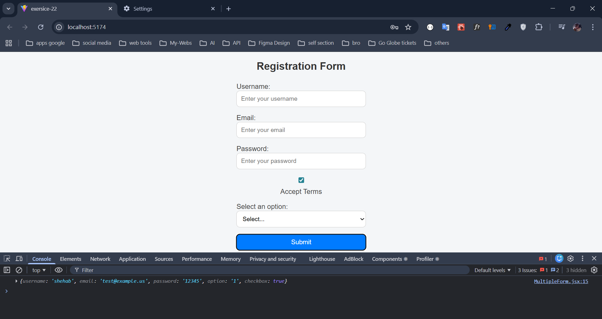

### **Practical Exercise**

- **Task:**
    - Create a form with multiple inputs (e.g., username, email, password, checkbox, select Dropdown).
    - Manage the form data using state.
    - Handle form submission and display the entered data.

    