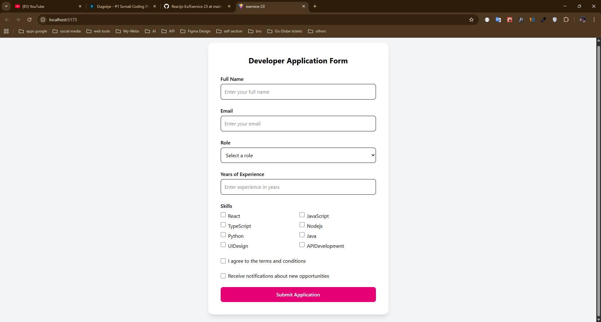

### **Practical Exercise |** Developer Application Form Challenge

## Objective

Create a professional job application form with real-time validation and modern UI using React and Tailwind CSS.

## Requirements

### Form Fields

1. **Full Name**
    - Letters only (2-30 characters)
    - No special characters except spaces
    - Required field
2. **Email**
    - Must be a valid email format
    - Required field
    - Real-time validation as user types
3. **Role Selection**
    - Dropdown menu with predefined roles
    - Required field
    - Options include:
        - Frontend Developer
        - Backend Developer
        - Full Stack Developer
        - UI/UX Designer
        - Product Manager
4. **Years of Experience**
    - Number input
    - Range: 0-50 years
    - Required field
    - Must be a valid number
5. **Skills**
    - Multiple checkbox selection
    - At least one skill must be selected
    - Options include:
        - React
        - JavaScript
        - TypeScript
        - Node.js
        - Python
        - Java
        - UI Design
        - API Development
6. **Terms & Conditions**
    - Checkbox
    - Must be checked to submit
    - Required field
7. **Notifications**
    - Optional checkbox
    - For receiving updates

### Validation Requirements

1. Implement real-time validation
2. Show error messages immediately after user input
3. Validate all fields before form submission
4. Prevent form submission if there are any errors

### UI/UX Requirements

1. Use Tailwind CSS for styling
2. Responsive design
3. Clear error messages in red
4. Visual feedback for form states:
    - Normal state
    - Error state
    - Focus state
    - Success state

### Code Structure

1. Use functional components
2. Implement proper state management
3. Separate validation logic
4. Handle form submission
5. Use proper event handling

## Bonus Challenges

1. Add form data persistence using localStorage
2. Implement a success message modal
3. Add loading state to submit button
4. Add field icons
5. Implement form reset functionality
