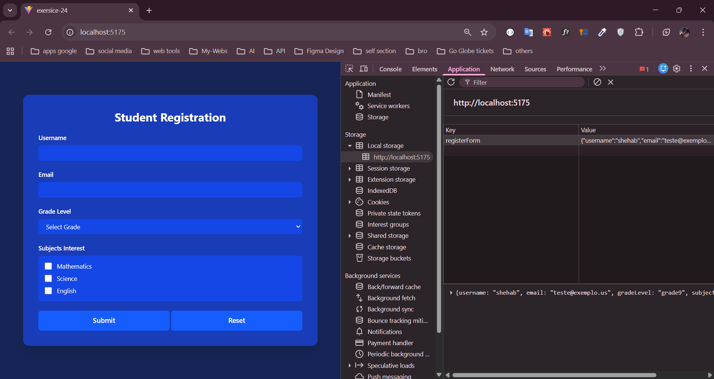
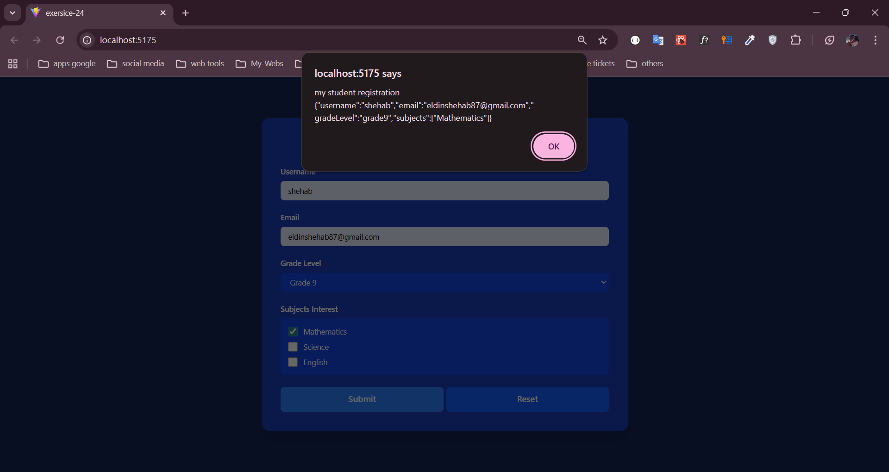

### **Practical Exercise for Lesson 5.5**

### **Exercise Title:** Student Registration Form Challenge - Instructions for Students

---

## Your Task

Create a student registration form that collects essential student information with proper validation.

### What You'll Build

A form that collects:

1. Student Name
2. Email Address
3. Grade Level (9-12)
4. Subject Interests

### Requirements

### 1. Form Fields

- **Student Name**
    - Must be at least 2 characters
    - Cannot be empty
    - Only letters and spaces allowed
- **Email**
    - Must be a valid email format ([example@domain.com](mailto:example@domain.com))
    - Cannot be empty
- **Grade Level**
    - Must select one grade from dropdown
    - Options: Grade 9, 10, 11, 12
    - Cannot be empty
- **Subject Interests**
    - Must select at least one subject
    - Options: Mathematics, Science, English
    - Checkbox style selection

### 2. Validation Requirements

- Show error messages in red
- Validate in real-time as user types
- Check all fields before submission

### 3. Form Submission

- Log form data to console when submitted
- Show success alert with form data
- Only submit if all validations pass
