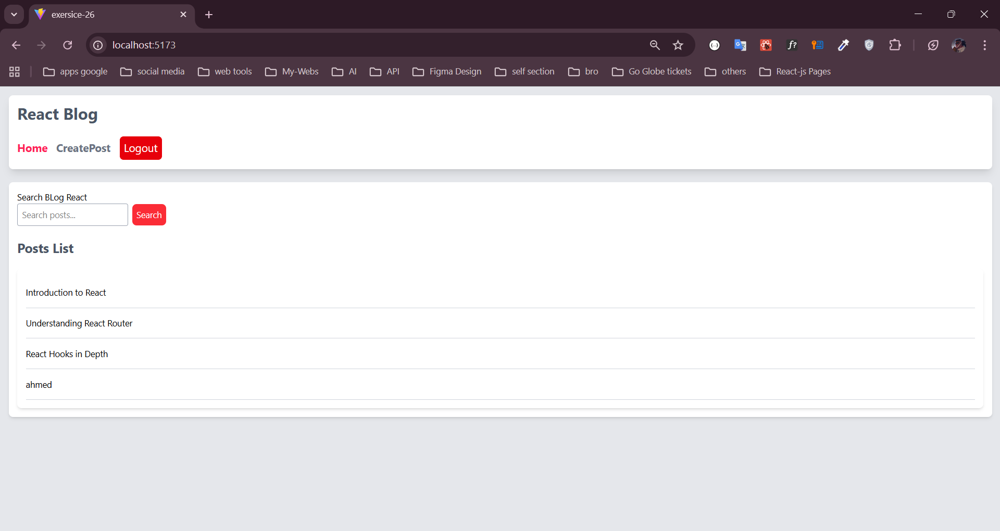
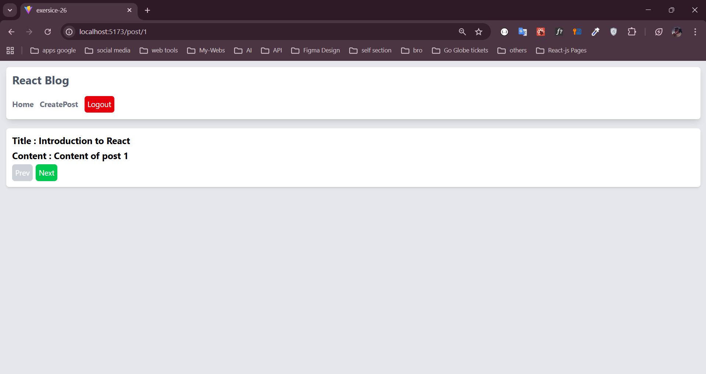
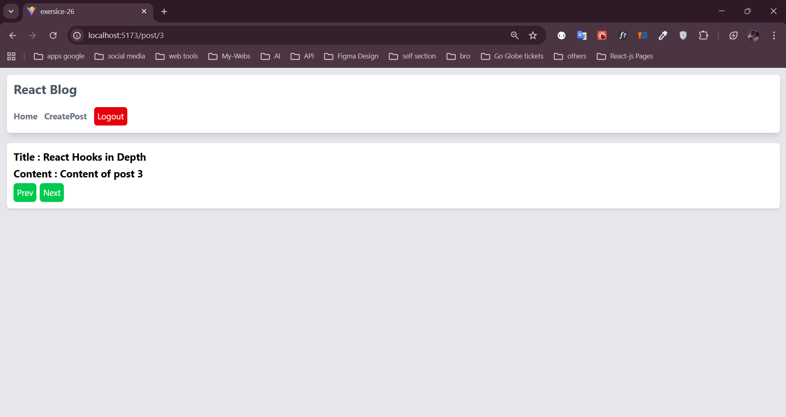
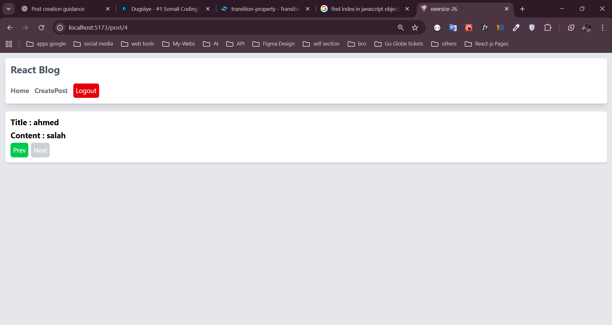

This exercise combines several key features of React Router:

- **Routing and Navigation:** Defining routes with `createBrowserRouter` and navigating using `<Link>` and programmatically with `useNavigate`.
- **Route Parameters:** Accessing dynamic segments of the URL with `useParams`.
- **Protected Routes:** Creating components that guard access to certain routes based on authentication status.
- **Passing State Between Routes:** Using the `state` option in `navigate` and accessing it with `useLocation`.
- **Query Parameters:** Reading and utilizing query parameters from the URL.
- **Error Handling:** Providing a user-friendly experience for undefined routes and errors.

